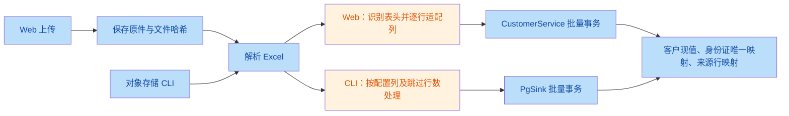
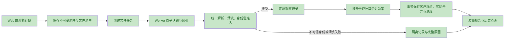

# 当前技术方案审查

日期：2026-10-05。代码基线：`main / 8e012bf`。范围：一期技术方案、导入清洗、客户存储、查询导出、任务恢复、部署运维与验收。

修复更新：用户已授权修复 R2、R13、R1，三项已完成本地实现与验证，详见第 7 节。第 1–6 节保留审查时的结论与基线行号，其他问题仍待处理。

**结论：保留现有 React + NestJS + PostgreSQL 技术栈。优先修复已复现的数据解析和身份合并问题，再补齐来源历史、任务状态与生产恢复能力。当前证据不足以证明亿级数据目标已经达成。**

本次审查只读业务数据，以合成文件和内存 mock 验证边界；未修改业务实现、重启服务或中断正在运行的导入。13 项问题均经两名独立验证者核对；优先级按当前单实例使用场景收敛，扩实例、启用对象存储定时任务和正式上线另有前置条件。未对生产服务器进行现场审计。

## 1. 当前实现与方案基线

业务意图是把批量 Excel 转成可校验、可查询、可追溯的客户主数据。以下已确定的业务规则继续保留：身份证为唯一合并依据；编码编号只是普通字段；身份证明文展示用于校验；15/17 位扩展、非法出生日期向前修复并重算校验位。

| 方面 | 当前实现 | 审查判断 |
|---|---|---|
| 一期主链路 | Web 上传 → 本地原件 → Excel 清洗 → 分批事务 → PostgreSQL → 客户管理 | 与当前需求匹配 |
| 对象存储入口 | 独立 CLI runner 和 PgSink，与 Web 共用部分清洗模块 | 两入口处理契约尚未统一 |
| 身份唯一性 | 独立 `customer_identity` 表维护全局身份证唯一，客户表按月分区 | 保留；不应退回编码匹配 |
| 写入保护 | 有序事务锁、批量 SQL、源行重放去重、事务内更新进度 | 有基础保障，不能描述为“没有幂等” |
| 更新规则 | 同身份证非空字段覆盖、版本递增；不比较统计时间 | 应明确业务策略，并补历史与真实变更统计 |
| 查询 | 游标分页；姓名、地址等已有 trgm 索引 | 每页计数、筛选项聚合仍需优化和测量 |
| 分区 | 新数据按导入月份入分区；启动预建未来三个月 | 不等于常用查询可以按月裁剪；长期维护需调度 |
| 远期方案 | Doris、HBase、Kafka、Spark、K8s 等出现在总方案中 | 应与“已实现的一期”分开标注 |

当前导入流程中，两入口在布局识别和写入实现上存在分叉：

## 2. 问题清单

P1：当前数据正确性或合法文件可用性缺陷，优先修复。P2：当前功能契约、追溯、容量或交付缺口；标出的启用条件满足前应完成整改。编号保留复核编号，按执行优先级排列。

| 编号 | 问题 | 建议 | 代码／文档证据 |
|---|---|---|---|
| **R2 · P1** | 中文跨数据块解码发生乱码；合成 5,000 行读回 15 行不一致 | 修复完整读取链路的流式 UTF-8 解码，覆盖自定义解析与依赖解析路径 | [xlsx-stream.ts:80–81](file:///Users/bytedance/Documents/trae_projects/潜客运营/web/apps/ingest-service/src/xlsx-stream.ts#L80-L81) |
| **R13 · P1** | 合法 Excel 的 ZIP 条目顺序触发解析崩溃；2 行文件读出 0 行 | 保证真实工作簿元数据就绪后解析，移除对私有状态的脆弱预置 | [xlsx-stream.ts:156–166](file:///Users/bytedance/Documents/trae_projects/潜客运营/web/apps/ingest-service/src/xlsx-stream.ts#L156-L166) |
| **R1 · P1** | “未知”等非空占位身份证能成为唯一键，把不同人合并 | 隔离占位值和非法格式；规范化结果达到身份键要求后再参与合并 | [id-card.ts:237–240](file:///Users/bytedance/Documents/trae_projects/潜客运营/web/apps/ingest-service/src/id-card.ts#L237-L240)、[导入:288–294](file:///Users/bytedance/Documents/trae_projects/潜客运营/web/apps/bff/src/modules/customer-import.service.ts#L288-L294) |
| **R3 · P2** | 批导入覆盖字段及当前来源，缺少字段前后值、身份证修正前后值历史 | 增加来源观察记录和实际变更明细，支持按身份证查看历次记录 | [customer.service.ts:143–167](file:///Users/bytedance/Documents/trae_projects/潜客运营/web/apps/bff/src/modules/customer.service.ts#L143-L167) |
| **R5 · P2** | 全行跳过仍缓存为成功；同文件返回旧报告，缺少明确重处理入口 | 区分执行结果与质量结果；显式支持查看旧报告、重新应用、按政策恢复 | [导入:160–174](file:///Users/bytedance/Documents/trae_projects/潜客运营/web/apps/bff/src/modules/customer-import.service.ts#L160-L174)、[导入:363–380](file:///Users/bytedance/Documents/trae_projects/潜客运营/web/apps/bff/src/modules/customer-import.service.ts#L363-L380) |
| **R4 · P2，扩实例前必修** | 任务认领仅在进程内；新实例会误标他人导入失败、重新调度未完成导出 | PostgreSQL 持久化队列、原子认领、租约、心跳和执行次数 | [导入:119–128](file:///Users/bytedance/Documents/trae_projects/潜客运营/web/apps/bff/src/modules/customer-import.service.ts#L119-L128)、[导出:78–83](file:///Users/bytedance/Documents/trae_projects/潜客运营/web/apps/bff/src/modules/customer-export.service.ts#L78-L83) |
| **R6 · P2，启用对象存储批任务前必修** | Web 与对象存储入口对无表头、电话地址错位、失败继续和重跑的处理不同 | 共用按文件执行的 ImportEngine，来源适配器只负责取得文件 | [runner.ts:120–134](file:///Users/bytedance/Documents/trae_projects/潜客运营/web/apps/ingest-service/src/runner.ts#L120-L134) |
| **R7 · P2，并行导入导出前补齐** | 导出分组统计和分页不共享快照，输出数量未核验 | 明确快照时间，固定本次导出的字段值，按实际写出数核对 | [导出:152–167](file:///Users/bytedance/Documents/trae_projects/潜客运营/web/apps/bff/src/modules/customer-export.service.ts#L152-L167)、[分页:219–230](file:///Users/bytedance/Documents/trae_projects/潜客运营/web/apps/bff/src/modules/customer-export.service.ts#L219-L230) |
| **R8 · P2** | 单省市超过 1,048,575 条数据时，导出未拆 sheet／文件 | 自动分片，输出文件清单、分片数量和总数核对结果 | [导出:210–215](file:///Users/bytedance/Documents/trae_projects/潜客运营/web/apps/bff/src/modules/customer-export.service.ts#L210-L215)、[写出:232–249](file:///Users/bytedance/Documents/trae_projects/潜客运营/web/apps/bff/src/modules/customer-export.service.ts#L232-L249) |
| **R9 · P2** | 成功 ZIP 过期只禁止下载；不同导出任务无限额调度，原件归档预算缺失 | 产物 TTL 清理、任务并发与磁盘预算；原件可靠归档后再回收本地副本 | [导出:104–117](file:///Users/bytedance/Documents/trae_projects/潜客运营/web/apps/bff/src/modules/customer-export.service.ts#L104-L117)、[过期时间:182](file:///Users/bytedance/Documents/trae_projects/潜客运营/web/apps/bff/src/modules/customer-export.service.ts#L182) |
| **R10 · P2** | 每页精确计数、筛选项全量聚合及行政区模糊匹配，缺当前规模混合负载验收 | 行政区用规范值等值筛选；计数和维度缓存／汇总；补当前版本压测 | [列表:107–117](file:///Users/bytedance/Documents/trae_projects/潜客运营/web/apps/bff/src/modules/customer.controller.ts#L107-L117)、[筛选项:130–143](file:///Users/bytedance/Documents/trae_projects/潜客运营/web/apps/bff/src/modules/customer.controller.ts#L130-L143) |
| **R11 · P2，正式上线前必补** | 运维手册未覆盖实际 PostgreSQL 恢复；生产环境未阻断鉴权旁路 | 补生产发布、迁移和恢复演练；生产配置禁止 AUTH_DISABLED；落实 token 接入 | [运维手册:111–118](file:///Users/bytedance/Documents/trae_projects/潜客运营/docs/08_运维文档/运维手册.md#L111-L118)、[auth.ts:45–47](file:///Users/bytedance/Documents/trae_projects/潜客运营/web/apps/bff/src/common/auth.ts#L45-L47) |
| **R12 · P2** | 一期文档仍写编码唯一、雪花 ID；容量与测试基线落后于实现 | 更新已实现方案与规则版本，历史压测标注对应提交，重新定义文件批次验收 | [一期范围:27–31](file:///Users/bytedance/Documents/trae_projects/潜客运营/docs/11_一期实施/一期范围与交付.md#L27-L31)、[验收:81–89](file:///Users/bytedance/Documents/trae_projects/潜客运营/docs/11_一期实施/一期范围与交付.md#L81-L89) |

## 3. 关键问题的触发条件与修复边界

**R2：不能只修自定义字符串解析器。** 自定义 `chunk.toString('utf8')` 不保留跨块字节状态。当前 ExcelJS 4.4.0 的 `browser-buffer-decode.js` 也逐块调用未启用流模式的 `TextDecoder.decode`。合成样例使用流式 writer，工作表延迟读取时会消费 ExcelJS 后来重建的共享字符串缓存。因此，15 行差异证明了整条解析链路的问题，不能归因成“只修第 81 行就结束”。建议使用每条 XML 流独立的流式解码器，或替换为经过验证的读取实现；用最终单元格值验收，覆盖共享字符串、内联字符串和富文本。不得直接改本地 node_modules 作为交付。

**R13：文件本身合法。** 样例 ZIP 中 `workbook.xml.rels → sheet1.xml → sharedStrings.xml → workbook.xml`。当前代码提前设置 `workbookReader.sharedStrings`，让依赖误认为可以立即解析工作表，随后访问尚未生成的 `model.sheets`。普通 ExcelJS reader 可以完整读出两行。修复应处理真实元数据和关系的就绪顺序，不能仅塞入空 model 来绕过异常。

**R1：宽容清洗与可靠身份键需要分开。** “未知”可以作为一条待处理来源记录保留，但不能代表一个确定的人。两个不同姓名、身份证都为“未知”的合成行均清洗成功，随后只剩最后一条。应在 Web、CLI 和手工新增／编辑共用身份键准入逻辑。日期修正规则继续保留，并记录原值、修正值、规则版本；现有校验位告警是否升级为拦截属于另一项业务政策，不应随本次修复擅自改变。

**R3：现有来源定位不等于字段历史。** `ingest_row_identity` 保存的是已写出源行到客户的定位，不包含每次字段前后值，批内被覆盖的来源行也不能靠它完整还原。手工 CRUD 已有审计，CLI 也有行告警；缺口集中在批导入字段历史及 Web 行级修正明细。原始文件仍能用于回查，不能声称历史已全部丢失。最近“同身份证对比之前文件”的需求说明，这项能力应进入近期建设范围。

**R5：幂等结果必须向操作者解释清楚。** mock 验证一行全部跳过仍为 SUCCESS，同文件重传直接返回旧任务；模拟删除客户后重传，未发生新 upsert，却仍返回历史 `inserted_rows=1`。这不意味着删除后应自动恢复。产品应明确“此文件曾处理过，展示原报告”，并提供受控的新执行入口。执行完成、质量通过、部分接受、全部拒绝应分开表达。

另一个静态可达路径：文件 A 失败，另一个相同哈希任务 B 成功，再重试 A；A 不走上传时的成功缓存检查，完成阶段会与 [成功文件唯一索引](file:///Users/bytedance/Documents/trae_projects/潜客运营/web/apps/ingest-service/migrations/002_reliability.sql#L63-L65) 冲突。应在任务模型层处理相同文件的执行关系，而不是在写完之后才失败。该路径本次未向真实数据库执行。

**R4／R6：任务记录已持久化，执行所有权尚未持久化。** 将 RUNNING 标为 FAILED 不会取消原执行，两个实例因此能同时认为自己有权处理同一任务。重试先读后写不是原子认领；槽位满时还会出现接口先接受、后台再失败。建议继续使用 PostgreSQL，通过原子 claim、worker_id、lease_until、heartbeat、attempt 维护执行权，终态更新也校验所属执行次数。保留已有源行重放保护。Web 请求尽早返回任务 ID，长任务由 worker 执行。

对象入口的跳过首行是配置默认值，不是硬编码；它缺少网页入口已实现的自动布局识别。同前缀中一个文件异常也会终止后续循环，之前提交的批次不会回滚。文件应各自形成任务，目录批任务聚合结果；两入口使用同一规则版本、文件身份和错误策略。

**R7／R8：导出要有可核对的结果契约。** mock 让分组计数返回 2，随后分页只返回 1，实际生成的 ZIP 成功，但报告和文件名仍称 2 条。真实并发修改省市还会改变分组归属。可以先在一致视图下物化本次导出的字段值，再分片写文件；若采用长事务快照，需评估 MVCC、磁盘和超时成本。仅固定客户 ID 不能冻结字段值。每 sheet 最多 1,048,576 行，含表头时数据上限是 1,048,575；单个工作簿可以多 sheet，不能把单 sheet 限制误写为整工作簿限制。

**R9／R10：先给资源使用定预算，再承诺规模。** 已有解析临时目录 finally 清理和部分磁盘余量检查，不能描述成所有临时文件泄漏。需要补的是成功导出产物回收、上传原件归档、跨任务并发限制及峰值空间预算。本次只读 EXPLAIN 对 `province LIKE '%四川省%'` 的计数选择了 `Parallel Append + Parallel Seq Scan`，覆盖月份分区；未使用 EXPLAIN ANALYZE，不能据此声称延迟已超标。常用行政区过滤应先区分等值选择与自由文本搜索。

**R11／R12：交付材料必须对应实装系统。** 运维文档的备份对象是 Doris、HBase、MySQL、Kafka，不能替代 PostgreSQL 主库恢复步骤。需要补 PostgreSQL 备份策略、异机恢复、校验和 RPO/RTO 实测；应用版本、迁移顺序、回滚边界及生产配置也应可重复执行。仓库允许 AUTH_DISABLED 在任何环境授予管理员，不代表生产当前已经这样配置。前端已有环境变量／localStorage token 入口，但正式登录、签发、刷新和失效契约仍需明确。

一期“单份 1 亿行 xlsx”与当前只读取指定一张 sheet 的能力不匹配，应改成“文件批次总行数”，并明确文件数、sheet 支持、单文件大小及最大解压体积。旧版 100 万行导入 183 秒的记录对应旧匹配／写入方案，不可当作当前身份证规则、批量 SQL 及高重复输入的验收结果。

## 4. 建议补齐的方案

以下为建议设计，尚未实现：

建议在现有模型上增加四类职责，具体表名可在实现时确定：

| 职责 | 最小信息 | 解决的问题 |
|---|---|---|
| 文件清单 | 内容哈希、对象位置／版本、原始文件名、sheet 清单、规则版本 | 同名不同文件识别、可靠重跑、原件归档 |
| 来源观察 | 文件、sheet、物理行号、原始身份证、规范身份证、原始／清洗值引用、质量状态 | 按身份证展示历次文件记录，解释日期修正与冲突 |
| 变更明细 | 客户 ID、任务／来源、实际变更字段前后值、决策原因、规则版本 | 解释为何覆盖，区分内容重复与实际更新 |
| 任务执行 | 任务 ID、attempt、worker、租约、心跳、进度、执行结果、质量结果 | 重启恢复、扩实例认领、重试状态一致 |

来源大字段可放在对象存储的分片文件中，PostgreSQL 保留索引与定位；不要未经容量测算就把所有原始行 JSON 和多份快照长期复制到主库。

**合并政策应形成版本化契约。** 身份证匹配规则不变；当前后导入非空覆盖是现有行为。建议为可比较的统计时间定义“更新较新值”的政策，对时间缺失、同时间冲突和人工修正定义优先级。该政策需业务确定后再实施，不能在修复解析器时顺手改变。无论最终政策如何，未改变字段的重复观察应能计入“内容未变”，而不是全部算“有效更新”。

**统计口径应可对账。** 分开报告读取数据行、清洗接受／拒绝行、文件内身份数、重复观察、新增客户、实际更新客户、内容未变、重放跳过。记录物理 Excel 行号用于定位。当前 `duplicate_rows` 主要反映批内去重，不能直接当作整文件独立身份证去重总数。

**容量验收按真实负载设计。** 在独立环境分别测 100 万／1,000 万有效客户、重复率 0%／50%／95% 的输入；同时执行列表、筛选、导入和导出。记录吞吐、P95、RSS、磁盘峰值、WAL、锁等待及任务队列长度。容量估算应包含客户表、唯一映射、来源与历史、索引、备份、WAL 和文件，不仅是客户行数。

## 5. 本次验证与后续验收

| 本次执行 | 结果 | 能证明的范围 |
|---|---|---|
| 5,000 行唯一中文字符串，流式写 XLSX 后经当前解析器读回 | 15 行字符串不一致，出现 U+FFFD；示例为第 360、540、900 行 | 当前依赖与解析组合存在跨块文字损坏；未推算历史库污染范围 |
| 普通 ExcelJS writer 生成 2 行 XLSX | 普通 reader 读出 2 行；当前解析器读出 0 行并报 `Cannot read properties of undefined (reading 'sheets')` | 合法 ZIP 排列触发读取失败 |
| 两个不同姓名，身份证均为“未知” | 均清洗通过，按身份证去重后仅剩后者 | 不可信身份键会误合并 |
| 实际 ImportService + 内存 Prisma／客户 mock | 全跳过被标 SUCCESS；重传同 job；模拟删后重传无新 upsert | 缓存／状态行为；不是实际数据库删除或唯一索引冲突测试 |
| 实际 ExportService + 内存数据 mock，读取生成 ZIP／XLSX | 报告 2 条、文件名 2 条、实际数据 1 条，状态 SUCCESS | 查询结果变化后未核对输出数；不是生产并发复现 |
| 现有清洗／解析单测 | 41 项通过 | 现有用例通过，未覆盖上述全部边界 |
| 现有导入布局单测 | 4 项通过 | 有／无表头和既有布局用例通过 |
| PostgreSQL 只读 EXPLAIN | 指定模糊行政区计数使用跨分区并行顺扫计划 | 规划证据；没有新 P95 或全量压测结论 |

未运行会写当前业务库的集成测试、重导或全量导出。临时合成脚本只在临时目录创建并清理测试文件；未改变原始 Excel。

整改验收应至少包含：

| 对应问题 | 必需验收条件 |
|---|---|
| R2、R13 | 普通／流式 writer、合法 ZIP 顺序排列、共享／内联字符串、富文本、多字节跨块均逐值一致；损坏文件仍明确拒绝 |
| R1 | 占位值不进入客户唯一键；15/17 位扩展和批准的日期修正规则回归通过；手工和两导入入口结果一致 |
| R3 | 同身份证至少三次导入可展示各来源原值、规范值、字段变化和合并理由；批内重复也能定位来源 |
| R5 | 同哈希成功／失败／重试／规则升级、全拒绝、删后再次上传均有明确结果；旧失败任务不会写完后才撞成功唯一索引 |
| R4 | 双 worker 抢任务只允许一个有效持有者；崩溃后租约到期可恢复；旧持有者不能覆盖新 attempt 的终态 |
| R6 | 同一测试文件经 Web 与对象入口得到一致结果；坏文件后下一文件继续；文件级重跑不重复应用已完成执行 |
| R7、R8 | 并发修改仍满足定义的快照契约；实际条数与清单一致；跨单 sheet 边界后所有分片可读且无漏重 |
| R9 | 过期产物可重复清理；在下载／执行中的文件不被误删；归档原件可恢复；达到资源限额时有明确排队或拒绝 |
| R10 | 当前版本在规定数据量、重复率、并发下完成混合压测，不以历史吞吐线性外推替代 |
| R11、R12 | 从空环境可按文档发布；备份在独立实例恢复并核对；生产禁用鉴权旁路；文档规则与测试结果绑定版本 |

## 6. 建议执行顺序

1. **先修 R2、R13、R1。** 三项均有合成证据，直接影响读入内容和客户身份。修复后对历史数据做只读抽样核对，再根据命中证据决定重处理范围。
2. **随后补 R3、R5，并统一 R6 的入口契约。** 把“来源是什么、为何覆盖、是否实际改变、如何重新应用”解释清楚。
3. **补任务与导出可靠性 R4、R7、R8、R9。** 扩实例前完成任务认领；并发导入导出前确认快照和数量契约。
4. **在上线与扩量前完成 R10、R11、R12。** 以当前实现的压测、生产配置检查和真实恢复演练作为依据。

现阶段不需要为这些缺口增加 Kafka、Doris 或 HBase。先补 PostgreSQL 任务执行、统一导入引擎和可追溯数据模型；未来查询负载超出已测边界时，再评估独立分析存储。

## 7. R2、R13、R1 修复与验证

修复日期：2026-10-05。

| 问题 | 实现结果 |
|---|---|
| R2 中文乱码 | 新增 `xlsx-xml.ts`，所有 XML 流使用独立的 `StringDecoder('utf8')` 保留跨块字节；共享／内联字符串、富文本和公式缓存字符串共用正确解码，不再经过 ExcelJS 的逐块解码路径。 |
| R13 合法 Excel 读取失败 | 先读取工作簿与关系文件，再按工作簿显示顺序及关系目标定位工作表；移除对 `WorkbookReader.sharedStrings` 私有状态的预置，读取不依赖 ZIP 排列或 sheet 文件名排序。保留解压预检、资源上限与临时目录清理。 |
| R1 身份证误合并 | 新增 `isValidIdCardIdentity`，在清洗、手工新增／编辑、BFF 批量写入和 CLI PgSink 统一校验归一化身份键。“未知”、非法字符、长度不符、无效年份等被拒绝；全重复数字不会通过日期修正变成身份键。导入按行记录 `invalid_id_card_format`，手工请求返回 HTTP 400。 |

保留身份证唯一、编码普通字段、15/17 位补全、非法日期向前修正并重算校验位、历史行政区兼容和既有错误校验位仅告警规则。导入流水线版本升至 3，用户重新上传旧文件时可应用新规则，不再直接复用版本 2 的成功报告；这不代表 R5 的完整重处理方案已经实现。

验证结果：

- ingest-service：69 项测试通过。覆盖两种 writer、共享／内联字符串各 5,000 行逐值比对、逐字节切分中文／emoji、富文本、实体、公式缓存、稀疏单元格、工作表显示顺序，以及损坏压缩数据在首行输出前拒绝。
- BFF：18 项测试通过，其中 7 项在独立 PostgreSQL 数据库执行，覆盖并发合并、重放跳过、批内保留最后一条、占位身份证拒绝及 15/17/18 位统一身份键；另有手工 API 和布局回归测试。
- 两个服务的 TypeScript 检查、构建及 `git diff --check` 通过。
- `seed/Demo.xlsx` 的 3 条数据只读清洗，与普通工作簿 reader 的清洗结果逐项一致。

测试数据库已删除；没有重导、清理或回补当前业务库的历史数据。此次验证不包含生产部署或亿级容量压测。

后续调整（同日）：按用户要求取消导入阶段编码编号的纯数字校验，同步修改导入窗口提示和相关说明；保留已有编码清洗、字段长度限制、姓名及身份证校验。流水线版本进一步升至 4。新增非数字／空编码回归，ingest-service 共 74 项测试通过，ingest-service、BFF、admin 构建通过。
