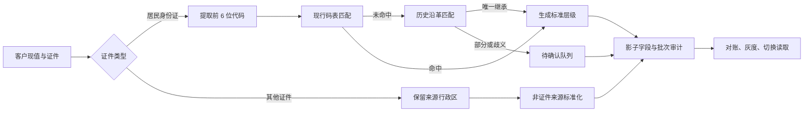

# 行政区划数据清洗与标准化方案

> 文档编号：TS-LeadOps-Region-001
> 版本：v1.0
> 日期：2026-10-05
> 状态：待实施
> 适用范围：客户导入、手工维护、客户列表、筛选、统计与批量导出

## 1. 结论

现有 `province/city/district` 不能直接按最新行政区划批量覆盖。居民身份证前 6 位表达的是证件登记时使用的行政区划代码，历史名称本身是有效来源信息；直接改成现行名称会丢失来源语义，也无法解释合并、撤销和一对多调整。

本方案采用双轨模型：

1. 保留现有 `province/city/district` 作为历史兼容字段，在迁移期不改值、不改含义。
2. 新增原始行政区划代码、现行标准代码与名称、行政层级、单位类型、映射状态、置信度和规则版本。
3. 居民身份证按前 6 位行政区划代码标准化；非居民证件不得从证件号推导行政区。
4. 名称变更、地区撤地设市等一对一关系可自动映射；涉及拆分、一对多或证据不足时进入待确认队列。
5. 所有回填先写影子字段，经过对账和灰度后再切换筛选、统计和导出，不改变身份证唯一键和客户总量。

## 2. 基准与口径

### 2.1 官方基准

行政区划主数据以民政部国家地名信息库发布的县级以上行政区划为准：

- 数据页面：<https://dmfw.mca.gov.cn/XzqhVersionPublish.html>
- 当前基准日期：2025-12-31
- 行政区划代码管理依据：<https://www.mca.gov.cn/gdnps/pc/content.jsp?mtype=1&id=1662004999980005812>
- 拉取接口：`https://dmfw.mca.gov.cn/9095/xzqh/getList?code=&maxLevel=3`
- 每次入库必须保存数据版本、拉取时间、来源 URL、原始文件或响应哈希，不只保存最终名称。

基准统计如下：

| 层级 | 数量 | 构成 |
|---|---:|---|
| 省级 | 34 | 23 省、5 自治区、4 直辖市、2 特别行政区 |
| 地级 | 333 | 293 地级市、30 自治州、7 地区、3 盟 |
| 县级 | 2,847 | 398 县级市、976 市辖区、1,302 县、117 自治县、49 旗、3 自治旗、1 林区、1 特区 |
| 非直辖市省级直辖县级单位 | 33 | 22 县级市、4 县、6 自治县、1 林区 |

### 2.2 “城市数量”必须分口径

系统不得再用一个 `city` 文本字段同时表达以下三种概念：

| 口径 | 数量 | 用途 |
|---|---:|---|
| 名称为“市”的行政区 | 695 | 4 直辖市 + 293 地级市 + 398 县级市，仅用于官方类型统计 |
| 地级行政区 | 333 | 官方行政层级统计，不含 4 个直辖市 |
| 业务城市等价分组 | 最多 370 | 4 直辖市 + 333 地级单位 + 33 个省直辖县级单位，用于城市维度筛选和统计 |

县级市不默认进入地级 `city`。地级市代管的县级市归入县级字段；省直辖县级单位没有地级父级，作为独立的业务城市等价分组，并显式标记类型。

## 3. 当前校验结果

### 3.1 数据规模

以下数量来自本次行政区划校验快照，用于方案验收基线，不代表文档提交后的实时数据库计数。

| 指标 | 数量 | 占比 |
|---|---:|---:|
| 有效客户 | 7,432,943 | 100% |
| `city` 非空客户 | 7,244,625 | 97.47% |
| `city` 为空客户 | 188,318 | 2.53% |
| 当前非空 `city` 标签 | 517 | - |

### 3.2 与现行官方名称精确比对

| 分类 | 标签数 | 客户数 |
|---|---:|---:|
| 命中现行官方名称 | 328 | 5,739,707 |
| 未命中现行官方名称 | 189 | 1,504,918 |
| 合计 | 517 | 7,244,625 |

在 `city` 非空数据中，按客户数计算的现行名称精确命中率为 79.23%；20.77% 使用历史名称、汇总标签或其他非现行名称。精确命中不等于层级使用正确，例如县级市即使名称有效，也可能被放在错误层级。

现行名称命中的构成为：

| 类型 | 标签数 | 客户数 |
|---|---:|---:|
| 地级市 | 282 | 5,124,631 |
| 直辖市 | 4 | 394,284 |
| 自治州 | 30 | 182,377 |
| 地区 | 7 | 23,932 |
| 盟 | 3 | 11,812 |
| 县级市 | 2 | 2,671 |

未命中的构成为：

| 类型 | 标签数 | 客户数 | 处理方向 |
|---|---:|---:|---|
| 历史地区 | 163 | 1,391,920 | 按历史代码映射现行继承单位 |
| 历史盟 | 6 | 48,721 | 按撤盟设市关系映射 |
| “直辖县级行政区划”汇总标签 | 12 | 40,747 | 删除伪城市标签，落到具体县级单位 |
| 历史城市 | 6 | 23,508 | 按撤销、合并或改区关系映射 |
| 历史自治州 | 1 | 13 | 按历史关系映射 |
| 其他 | 1 | 9 | 人工复核 |

### 3.3 缺失的现行地级市标签

系统 `city` 标签中未出现 11 个现行地级市：

`贺州市、儋州市、铜仁市、丽江市、日喀则市、昌都市、林芝市、山南市、那曲市、张掖市、海东市`

除儋州市外，其余 10 个城市对应的旧“地区”标签共有 17,689 条客户记录。它们应通过身份证行政区代码和历史沿革映射到现行单位，不能只做名称字符串替换。

### 3.4 根因

1. [`parseIdCard`](../../web/apps/ingest-service/src/id-card.ts) 依次使用补充码表、现行码表、2020 年及以前历史快照和手工回落表，输出的是混合时间口径。
2. `city` 为空时，代码会生成“`${province}直辖县级行政区划`”汇总标签，该标签不是具体行政区。
3. 现有 [`gb2260.json`](../../web/apps/ingest-service/configs/gb2260.json) 同时包含现行值和常见历史别名，但没有完整的生效时间、父子关系、变更类型和现行继承关系。
4. 数据库只保存名称，不保存行政区划代码、来源版本、映射方式和置信度。
5. 列表筛选使用模糊文本匹配，导出直接按旧 `province/city` 分组，历史名称会被当成独立城市。

## 4. 目标数据模型

### 4.1 行政区划主数据

新增 `administrative_division`，保存每个版本的标准行政区：

| 字段 | 类型建议 | 含义 |
|---|---|---|
| `dataset_version` | `VARCHAR(32)` | 如 `MCA_2025-12-31` |
| `code` | `CHAR(6)` | 六位行政区划代码 |
| `name` | `VARCHAR(64)` | 该版本标准名称 |
| `level` | `VARCHAR(16)` | `province/prefecture/county` |
| `division_type` | `VARCHAR(32)` | 省、自治区、直辖市、地级市、自治州、地区、盟、县级市等 |
| `parent_code` | `CHAR(6)` | 标准父级代码 |
| `effective_from/to` | `DATE` | 可确认时填写 |
| `is_current` | `BOOLEAN` | 是否为该数据集现行记录 |
| `source_url` | `TEXT` | 官方来源 |
| `source_hash` | `CHAR(64)` | 原始数据哈希 |

主键建议为 `(dataset_version, code)`；另建 `(code, is_current)`、`(parent_code, level)` 和标准名称索引。

### 4.2 历史沿革映射

新增 `administrative_division_crosswalk`：

| 字段 | 含义 |
|---|---|
| `source_code/name` | 历史代码和名称 |
| `source_level/type` | 历史层级和类型 |
| `target_code` | 现行继承单位代码，可为空 |
| `mapping_kind` | `rename/upgrade/merge/split/abolished/unchanged` |
| `mapping_scope` | `full/parent_only/ambiguous` |
| `auto_apply` | 是否允许自动回填 |
| `confidence` | `0-100` |
| `evidence` | 民政部批复、历史码表版本或人工依据 |

一对多拆分不得伪造唯一目标。能够确认现行省级或地级父级、但无法确认县级目标时，只回填到可确认层级，并将 `mapping_scope` 记为 `parent_only`。

### 4.3 客户标准化字段

现有 `province/city/district` 在迁移期保持不变。建议在 `customer` 增加以下影子字段：

| 字段 | 含义 |
|---|---|
| `origin_region_code` | 居民身份证前 6 位原始行政区代码 |
| `current_province_code/name` | 现行省级单位 |
| `current_prefecture_code/name` | 现行地级单位；省直辖县级单位可为空 |
| `current_county_code/name` | 现行县级单位 |
| `current_division_type` | 最具体命中单位的官方类型 |
| `region_group_code/name` | 业务城市等价分组 |
| `region_group_type` | `municipality/prefecture/province_direct_county/unknown` |
| `region_source` | `resident_id/source_field/manual/unknown` |
| `region_mapping_status` | `current/historical_mapped/partial/ambiguous/unresolved/not_applicable` |
| `region_mapping_method` | `current_code/historical_crosswalk/exact_name/manual/none` |
| `region_confidence` | `0-100` |
| `region_dataset_version` | 如 `MCA_2025-12-31` |
| `region_rule_version` | 如 `region-v1` |
| `region_standardized_at` | 标准化时间 |

`origin_region_code` 只表达证件中的历史代码，不等于当前居住地。系统页面和导出应把“证件归属行政区”与“联系地址”明确区分。

为避免在通用 `audit_log` 中写入数百万条大 JSON，新增轻量的 `region_standardization_batch` 和 `region_standardization_change`：

- 批次表保存规则版本、数据版本、条件、总量、各状态数量、开始结束时间和操作者。
- 明细表保存客户复合主键、批次、旧值哈希、新值、状态和错误；按保留期归档。
- 首次回填时旧影子字段为空，回滚可按批次清空；后续版本升级必须保留前一版本值或可恢复快照。

## 5. 标准化规则

### 5.1 规则优先级

按以下顺序执行，命中后不再使用更低优先级规则：

1. **非居民证件**：不从证件号推导行政区。保留来源字段并记 `region_source=source_field`；没有独立、可靠行政区来源时，映射状态为 `not_applicable`。自由文本地址另走地址标准化。
2. **居民身份证格式有效且前 6 位命中现行代码**：直接写入现行省、地、县层级，方法为 `current_code`，置信度 100。
3. **前 6 位命中历史代码且存在唯一现行继承单位**：保留原代码，按 crosswalk 写现行层级，方法为 `historical_crosswalk`，置信度建议 95。
4. **历史变更只可确认父级**：只写可证明的省级或地级值，县级留空，状态为 `partial`。
5. **一对多、代码复用或证据冲突**：不猜测目标，状态为 `ambiguous`，进入人工队列。
6. **代码未命中、现有名称能精确命中唯一标准单位**：仅作为低置信度补充，不反向改写 `origin_region_code`，方法为 `exact_name`，置信度建议 70。
7. **“直辖县级行政区划”等汇总标签**：不得作为标准名称。应使用前 6 位代码定位具体县级单位；无法定位时标记 `unresolved`。
8. **无代码、无可靠名称**：现行标准字段为空，状态为 `unresolved`，不得自动填“未知城市”；兼容字段 `province` 对居民身份证默认填“其他”。

身份证出生日期只能辅助识别明显不可能的历史版本，不能直接作为行政区代码生效时间。身份证行政区代码可能在出生后签发或换证，不能假设“出生年份就是码表年份”。

### 5.2 层级落位

| 场景 | 省级字段 | 地级字段 | 县级字段 | 业务分组 |
|---|---|---|---|---|
| 北京市朝阳区 | 北京市 | 空 | 朝阳区 | 北京市，`municipality` |
| 四川省成都市都江堰市 | 四川省 | 成都市 | 都江堰市 | 成都市，`prefecture` |
| 湖北省仙桃市 | 湖北省 | 空 | 仙桃市 | 仙桃市，`province_direct_county` |
| 海南省儋州市 | 海南省 | 儋州市 | 按具体代码 | 儋州市，`prefecture` |
| 历史上饶地区 | 江西省 | 上饶市 | 能确认则填写 | 上饶市，`prefecture` |

直辖市在官方层级上是省级单位，不伪造同名地级记录。`region_group_*` 用于城市维度筛选和统计，不作为省级导出拆分依据。

### 5.3 典型历史映射

以下仅为规则示例，正式值必须进入 crosswalk 并附来源：

| 历史值 | 现行目标 | 类型 |
|---|---|---|
| 巴彦淖尔盟 | 巴彦淖尔市 | `upgrade` |
| 伊克昭盟 | 鄂尔多斯市 | `rename + upgrade` |
| 上饶地区 | 上饶市 | `upgrade` |
| 莱芜市 | 济南市莱芜区 | `merge` |
| 涪陵市 | 重庆市涪陵区 | `merge + level_change` |

名称相同不代表代码或层级相同；代码相同也可能在不同版本中发生名称变化。程序必须使用版本化关系，不使用全局字符串替换表。

## 6. 清洗处理流程



处理过程分为：

1. 固化官方数据快照和 crosswalk，不在回填过程中在线调用民政部接口。
2. 对所有活跃客户生成只读评估结果，输出状态、方法、目标代码和变更摘要。
3. 评估通过后写入 staging 表，不直接更新客户表。
4. 对 staging 做层级、父子关系、数量和抽样验收。
5. 按客户分区和稳定游标分批回填影子字段。
6. 客户页面灰度读取新字段，旧字段同时展示用于核对。
7. 筛选、统计和导出切换到代码等值条件。
8. 稳定运行后决定是否保留旧字段；本期不删除。

## 7. 回填设计

### 7.1 批次与幂等

- 建议迁移文件：`008_administrative_division_standardization.sql`。
- 每次运行生成 `region_batch_id`，绑定 `dataset_version + rule_version + source_hash`。
- 使用 `(customer_id, ingest_month)` 稳定游标，每批 10,000 至 20,000 行。
- staging 主键包含客户复合主键和规则版本；重复运行使用 upsert，但目标值哈希未变化时不更新。
- 客户回填条件必须包含预期旧 `region_rule_version` 或旧值哈希，避免覆盖并发人工修正。
- 第二次使用同一数据版本和规则运行时，预期更新行数为 0。

### 7.2 写入边界

回填只更新新增的标准化字段，不得修改：

- `id_type/id_card` 和 `customer_identity`
- `province/city/district`
- `name/phone/address`
- `ingest_month`
- 客户业务 `version`，除非产品明确把后台标准化视为业务编辑

标准化批次失败不影响导入和客户查询。每批独立事务，失败可从最后成功游标继续。

### 7.3 暂停与回滚

- 回填任务支持 `PENDING/RUNNING/PAUSING/PAUSED/SUCCESS/FAILED/ROLLED_BACK`。
- 运行中任务先暂停，再执行回滚。
- 首次回填回滚：按 `region_batch_id` 和值哈希将本批写入的影子字段清空。
- 规则升级回滚：从 `region_standardization_change` 或批次快照恢复前一版本。
- 已被人工确认的记录设置保护标记，批量回滚不得覆盖人工值。
- 回滚后重新执行客户数、身份证唯一映射数和导出总数对账。

## 8. 待确认队列

以下记录进入人工处理页，不阻塞其他数据：

| 原因 | 自动动作 | 人工动作 |
|---|---|---|
| 历史代码对应多个现行单位 | 只填共同父级 | 选择目标或保持部分映射 |
| 代码未命中但名称多义 | 不自动映射 | 结合省级、县级和来源文件确认 |
| 省市县父子关系冲突 | 拒绝写标准字段 | 修正 crosswalk 或来源值 |
| “直辖县级行政区划”且无有效前 6 位 | 标记未解析 | 回查原文件 |
| 非居民证件只有自由文本地址 | 保留原文 | 进入独立地址标准化流程 |

人工决定必须记录操作者、依据、前后值、适用范围和规则版本。可复用的决定进入 crosswalk；单条特例只写客户人工覆盖，不污染全局规则。

## 9. 系统改造

### 9.1 导入与手工维护

- `parseIdCard` 拆分为“身份证基础属性解析”和“行政区划解析”两个职责。
- 导入时保存 `origin_region_code`，行政区解析器返回代码、层级、类型、状态和规则版本，不只返回名称。
- 码表优先级改为版本化主数据和 crosswalk；`extraCityCode/extraDistrictCode` 只作为受审计的临时覆盖。
- 停止生成“某省直辖县级行政区划”作为城市名称。
- 新导入数据直接写标准字段；旧数据由回填任务处理，二者使用同一解析库和规则版本。

### 9.2 客户列表与筛选

- 将筛选项名称从“城市”调整为“城市/地级区划”或拆成“地级行政区”和“县级行政区”。
- 省、地、县筛选传标准代码，后端使用等值查询，不再 `contains` 模糊匹配行政区名称。
- 筛选项来自 `administrative_division` 和有数据的代码聚合，不再每次对 743 万客户全表 `groupBy` 名称。
- 列表可显示“现行标准归属”和“证件原始归属”，历史映射记录显示状态标识。

### 9.3 导出

- 居民身份证按现行省级代码分文件，每个省级单位生成一个文件。
- 文件名使用“省份名称-条数.xlsx”，不包含城市名称。
- 省份无法识别的居民身份证将兼容省份填为“其他”，统一进入“其他-条数.xlsx”。
- 单省超过 1,048,575 条数据时，仍保持一个文件，并在文件内自动增加工作表。
- 非居民证件继续合并为一个文件，不从证件号码推导城市。
- 导出增加原始行政区代码、现行省、现行地级、现行县级、单位类型、映射状态和规则版本列。
- 任务报告按状态统计 `current/historical_mapped/partial/ambiguous/unresolved/not_applicable`，文件实际行数必须与任务总数对账。

### 9.4 API 兼容

迁移期 API 同时返回旧字段和新对象：

```json
{
  "province": "江西省",
  "city": "上饶地区",
  "district": "上饶县",
  "region": {
    "origin_code": "362321",
    "current_province": { "code": "360000", "name": "江西省" },
    "current_prefecture": { "code": "361100", "name": "上饶市" },
    "current_county": { "code": "361104", "name": "广信区" },
    "group": { "code": "361100", "name": "上饶市", "type": "prefecture" },
    "status": "historical_mapped",
    "dataset_version": "MCA_2025-12-31",
    "rule_version": "region-v1"
  }
}
```

示例只说明结构。`362321` 到现行县级目标的正式映射必须由 crosswalk 数据确认后生成。

## 10. 分阶段上线

| 阶段 | 工作 | 放行条件 |
|---|---|---|
| P0 基线冻结 | 保存官方原始数据、哈希、当前统计和数据库备份 | 基准可重复生成 |
| P1 主数据建设 | 建 division、crosswalk、解析器和测试 | 34/333/2,847 数量及父子关系校验通过 |
| P2 只读评估 | 全量生成 staging 和问题报告 | 不写客户表；所有记录有明确状态 |
| P3 影子回填 | 分批写新字段并支持暂停、续跑、回滚 | 客户数和身份映射数不变 |
| P4 灰度读取 | 内部页面双轨展示，抽样核验历史映射 | 业务确认口径 |
| P5 查询导出切换 | 筛选与导出改用标准代码 | 新旧总数可解释，导出逐文件对账 |
| P6 稳定运行 | 监控至少一个完整业务周期 | 再决定旧字段后续策略 |

不建议把码表更新、全量回填、UI 切换和旧字段清理放在同一次发布中。

## 11. 验收标准

### 11.1 主数据

1. 指定版本包含 34 个省级、333 个地级、2,847 个县级单位。
2. 每个非省级现行单位都有合法父级；不存在循环父子关系。
3. 标准名称、代码、层级和类型可追溯到来源哈希。
4. 4 个直辖市、33 个省直辖县级单位有明确业务分组规则。

### 11.2 数据质量

1. 7,432,943 条活跃客户在回填前后数量一致。
2. `customer_identity` 数量及 `(id_type,id_card)` 唯一性不变。
3. 所有活跃客户都有 `region_mapping_status` 和 `region_rule_version`；不适用也必须显式记录。
4. 现行标准字段中不出现“直辖县级行政区划”汇总标签。
5. 县级市不会误写到地级字段；省直辖县级单位的地级字段为空且分组类型正确。
6. 189 个非现行标签全部进入“已映射、部分映射、歧义、未解析”之一，数量之和等于 1,504,918。
7. 11 个缺失现行地级市通过标准代码可筛选；不要求旧 `city` 文本被覆盖。
8. 同一规则版本重复执行，客户更新数为 0。

### 11.3 功能与性能

1. 列表、筛选、统计和导出对同一组标准代码返回相同客户数。
2. 居民身份证导出按省份一省一文件，文件名不包含城市名称；超出单工作表上限时在同一文件内分表，也不产生伪“直辖县级行政区划”文件。
3. 非居民证件导出行为保持不变。
4. 回填可暂停、恢复和回滚；进程重启后不重复覆盖。
5. 在 743 万现有数据上记录回填吞吐、锁等待、WAL 增量、表膨胀、索引大小和列表 P95。

建议验收 SQL：

```sql
-- 回填不得改变活跃客户总量
SELECT count(*) FROM customer WHERE is_deleted = FALSE;

-- 每条活跃数据必须有明确标准化状态
SELECT region_mapping_status, count(*)
FROM customer
WHERE is_deleted = FALSE
GROUP BY region_mapping_status
ORDER BY region_mapping_status;

-- 标准字段禁止出现汇总伪标签
SELECT count(*)
FROM customer
WHERE is_deleted = FALSE
  AND (
    current_prefecture_name LIKE '%直辖县级行政区划%'
    OR region_group_name LIKE '%直辖县级行政区划%'
  );

-- 县级市不得占用地级字段
SELECT count(*)
FROM customer c
JOIN administrative_division d
  ON d.dataset_version = c.region_dataset_version
 AND d.code = c.current_prefecture_code
WHERE c.is_deleted = FALSE
  AND d.level = 'county';

-- 幂等复跑应无目标值变化
SELECT count(*)
FROM region_standardization_change
WHERE region_batch_id = :repeat_batch_id
  AND old_value_hash IS DISTINCT FROM new_value_hash;
```

## 12. 风险与控制

| 风险 | 控制 |
|---|---|
| 历史代码一对多导致误归属 | 只自动处理唯一继承，歧义进入人工队列 |
| 把证件归属误当现居城市 | 页面和导出明确字段语义，联系地址另行标准化 |
| 743 万行回填造成锁和 WAL 压力 | 小批事务、限速、低峰执行、持续监控和暂停 |
| 名称更新导致筛选结果漂移 | API 和查询使用代码，名称绑定数据版本 |
| 新旧导出分组数量变化 | 灰度期双跑并输出差异报告 |
| 非居民证件被错误推导 | 按证件类型硬隔离，不从号码提取行政区 |
| 人工修正被批处理覆盖 | 乐观条件、人工保护标记和规则优先级 |
| 回滚信息不足 | 回填前备份、批次快照、变更哈希和详细统计 |

## 13. 本期不做

- 不直接覆盖或删除现有 `province/city/district`。
- 不依据出生日期猜测身份证行政区代码所属年份。
- 不对非居民证件号码套用居民身份证行政区规则。
- 不把自由文本地址标准化与本次证件归属标准化混为同一任务。
- 不在没有官方依据时自动处理一对多历史拆分。
- 不因标准化回填改变客户唯一键、客户合并关系或客户业务版本。

## 14. 实施产物

实施阶段至少应产出：

1. 民政部行政区划原始快照、哈希和导入脚本。
2. `administrative_division`、`administrative_division_crosswalk` 及回填任务 DDL。
3. 版本化行政区解析库和单元测试。
4. 全量只读评估报告，包括 517 个旧标签逐项去向。
5. 歧义和未解析记录清单。
6. 影子字段回填、暂停、续跑和回滚工具。
7. 新旧筛选与导出结果对账报告。
8. 生产执行记录、性能指标和最终验收报告。
